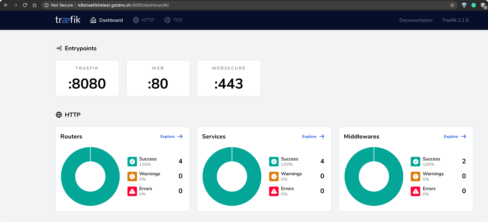
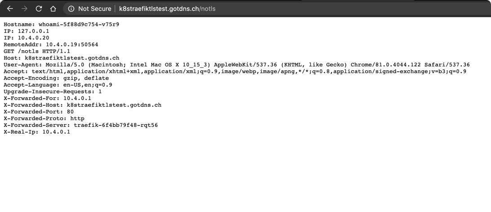
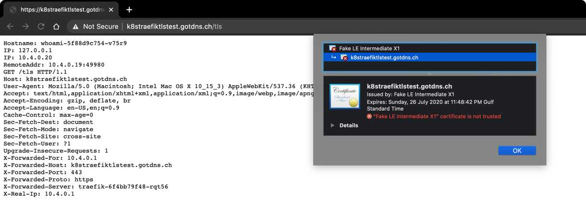
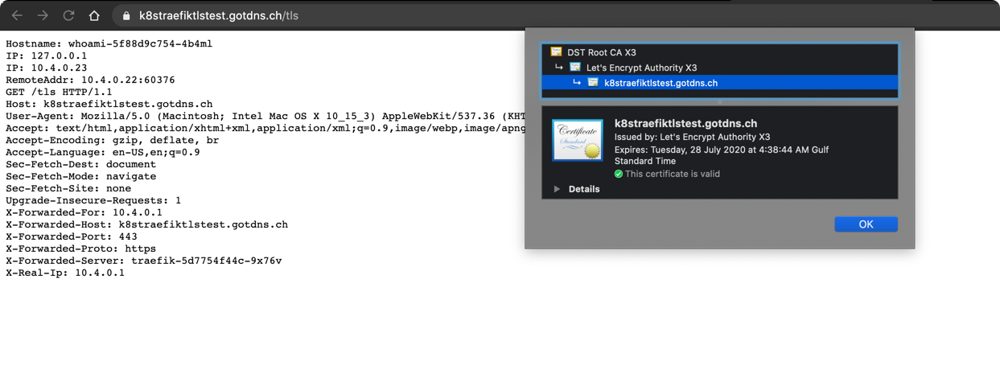

## To deploy traefik on GKE with whoami service and get certificate using lets encrypt


- Ensure that the following line is uncommented in traefik-deployment resource. Right 
now you are using staging env to obtain certificates. On main let's encrypt 
you have only 5 requests per hour before you will be banned and it is not recommended to use production env for testing.
```yaml
            - --certificatesresolvers.default.acme.caserver=https://acme-staging-v02.api.letsencrypt.org/directory
```

- Run the following command and create all the resource objects except ingress-route

```bash
$ kubectl apply -f 00-resource-crd-definition.yml,05-traefik-rbac.yml,10-service-account.yaml,15-traefik-deployment.yaml,20-traefik-service.yaml,25-whoami-deployment.yaml,30-whoami-service.yaml
customresourcedefinition.apiextensions.k8s.io/ingressroutes.traefik.containo.us created
customresourcedefinition.apiextensions.k8s.io/middlewares.traefik.containo.us created
customresourcedefinition.apiextensions.k8s.io/ingressroutetcps.traefik.containo.us created
customresourcedefinition.apiextensions.k8s.io/tlsoptions.traefik.containo.us created
customresourcedefinition.apiextensions.k8s.io/traefikservices.traefik.containo.us created
clusterrole.rbac.authorization.k8s.io/traefik-ingress-controller created
clusterrolebinding.rbac.authorization.k8s.io/traefik-ingress-controller created
serviceaccount/traefik-ingress-controller created
deployment.apps/traefik created
service/traefik created
deployment.apps/whoami created
service/whoami created
```

- Get the IP of the Traefik Service exposed as Load Balancer
```bash
$ kubectl get service
NAME         TYPE           CLUSTER-IP      EXTERNAL-IP    PORT(S)                                     AGE
kubernetes   ClusterIP      10.109.0.1      <none>         443/TCP                                     6h16m
traefik      LoadBalancer   35.238.72.172   34.69.16.102   80:32318/TCP,443:32634/TCP,8080:32741/TCP   70s
whoami       ClusterIP      10.109.14.91    <none>         80/TCP                                      70s
```


- Create a DNS record for this IP
```bash
$ nslookup k8straefiktlstest.gotdns.ch
Server:         192.168.1.1
Address:        192.168.1.1#53

Non-authoritative answer:
Name:   k8straefiktlstest.gotdns.ch
Address: 35.238.72.172
```

- Create the resource ingress-route
```bash
$ kubectl apply -f 35-ingress-route.yaml
ingressroute.traefik.containo.us/simpleingressroute created
ingressroute.traefik.containo.us/ingressroutetls created
```

- Logs of traefik
```bash
time="2020-04-27T20:48:28Z" level=debug msg="Domains [\"k8straefiktlstest.gotdns.ch\"] need ACME certificates generation for domains \"k8straefiktlstest.gotdns.ch\"." routerName=default-ingressroutetls-b5387612c35191f15ee4@kubernetescrd rule="Host(`k8straefiktlstest.gotdns.ch`) && PathPrefix(`/tls`)" providerName=default.acme
time="2020-04-27T20:48:28Z" level=debug msg="Loading ACME certificates [k8straefiktlstest.gotdns.ch]..." providerName=default.acme routerName=default-ingressroutetls-b5387612c35191f15ee4@kubernetescrd rule="Host(`k8straefiktlstest.gotdns.ch`) && PathPrefix(`/tls`)"
time="2020-04-27T20:48:29Z" level=debug msg="Building ACME client..." providerName=default.acme
time="2020-04-27T20:48:29Z" level=debug msg="https://acme-staging-v02.api.letsencrypt.org/directory" providerName=default.acme
time="2020-04-27T20:48:30Z" level=info msg=Register... providerName=default.acme
time="2020-04-27T20:48:30Z" level=debug msg="legolog: [INFO] acme: Registering account for emailexample@gmail.com"
time="2020-04-27T20:48:30Z" level=debug msg="Using TLS Challenge provider." providerName=default.acme
time="2020-04-27T20:48:30Z" level=debug msg="legolog: [INFO] [k8straefiktlstest.gotdns.ch] acme: Obtaining bundled SAN certificate"
time="2020-04-27T20:48:30Z" level=debug msg="legolog: [INFO] [k8straefiktlstest.gotdns.ch] AuthURL: https://acme-staging-v02.api.letsencrypt.org/acme/authz-v3/52039075"
time="2020-04-27T20:48:30Z" level=debug msg="legolog: [INFO] [k8straefiktlstest.gotdns.ch] acme: use tls-alpn-01 solver"
time="2020-04-27T20:48:30Z" level=debug msg="legolog: [INFO] [k8straefiktlstest.gotdns.ch] acme: Trying to solve TLS-ALPN-01"
time="2020-04-27T20:48:30Z" level=debug msg="TLS Challenge Present temp certificate for k8straefiktlstest.gotdns.ch" providerName=acme
time="2020-04-27T20:48:37Z" level=debug msg="legolog: [INFO] [k8straefiktlstest.gotdns.ch] The server validated our request"
time="2020-04-27T20:48:37Z" level=debug msg="TLS Challenge CleanUp temp certificate for k8straefiktlstest.gotdns.ch" providerName=acme
time="2020-04-27T20:48:37Z" level=debug msg="legolog: [INFO] [k8straefiktlstest.gotdns.ch] acme: Validations succeeded; requesting certificates"
time="2020-04-27T20:48:42Z" level=debug msg="legolog: [INFO] [k8straefiktlstest.gotdns.ch] Server responded with a certificate."
time="2020-04-27T20:48:42Z" level=debug msg="Certificates obtained for domains [k8straefiktlstest.gotdns.ch]" providerName=default.acme routerName=default-ingressroutetls-b5387612c35191f15ee4@kubernetescrd rule="Host(`k8straefiktlstest.gotdns.ch`) && PathPrefix(`/tls`)"
time="2020-04-27T20:48:42Z" level=debug msg="Configuration received from provider default.acme: {\"http\":{},\"tls\":{}}" providerName=default.acme
time="2020-04-27T20:48:42Z" level=debug msg="Adding certificate for domain(s) k8straefiktlstest.gotdns.ch"
```


- Results Acheived
    - Dashboard


- Whoami Service with notls



- Whoami service with tls generated by ACME let's encrypt




##  Next Steps 
- Delete the traefik deployment
```bash
kubectl delete -f 15-traefik-deployment.yaml
```

- Let's remove the Fake part in our cert. In order to do that you would need to comment out the line
```yaml
#            - --certificatesresolvers.default.acme.caserver=https://acme-staging-v02.api.letsencrypt.org/directory
```

- Once the line is commented out, you lets recreate the deployment
```bash
kubectl apply -f 15-traefik-deployment.yaml
```

- Once deployment is completed, visit the URL again and behold the sweet and beautiful ACME certificate waiting for you!


    
  
