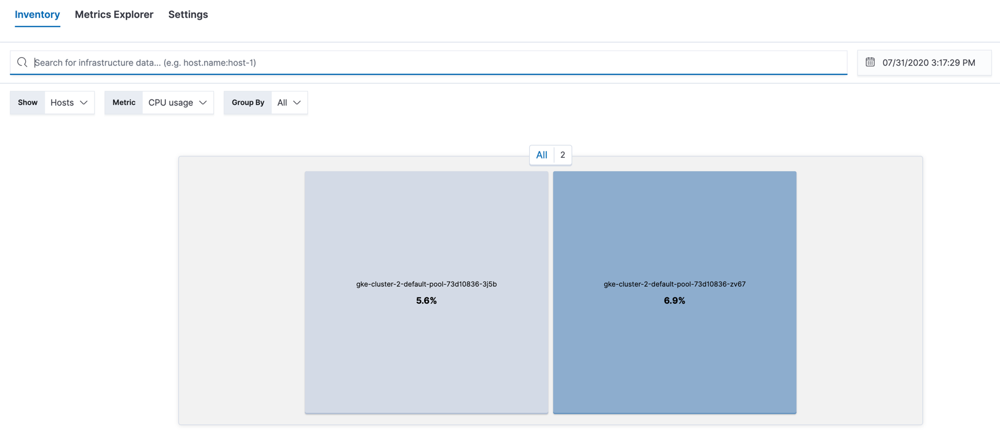
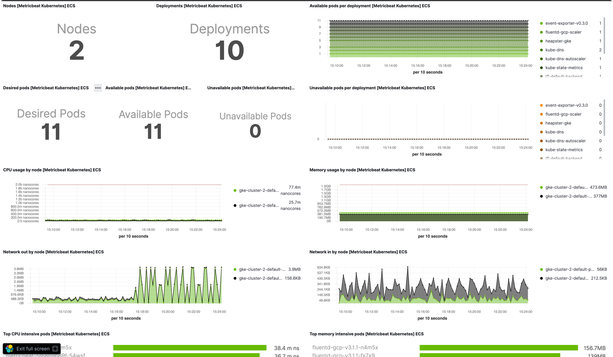

### To start metricbeat in kubernetes cluster and ship the kubernetes metrics to elastic search which can be viewed by kibana

#### You can install elastic-search docker and kibana docker by visiting [elastic-search-docker](https://github.com/codeaprendiz/ansible-kitchen/tree/master/playbooks/roles/elastic-search-cluster-docker) and 
[kibana-docker](https://github.com/codeaprendiz/ansible-kitchen/tree/master/playbooks/roles/kibana-docker)

- Docs referred

    - [k8s resources](https://raw.githubusercontent.com/elastic/beats/7.8/deploy/kubernetes/metricbeat-kubernetes.yaml)

    - [metricbeat](https://www.elastic.co/guide/en/beats/metricbeat/current/metricbeat-reference-yml.html)

- Apply the k8s resources 
```bash
$ kubectl apply -f .

```

- Metricbeat logs after successful connection to elastic search

```bash
2020-07-31T10:18:29.404Z        INFO    [publisher_pipeline_output]     pipeline/output.go:144  Connecting to backoff(elasticsearch(http://35.226.68.74:9200))
2020-07-31T10:18:34.475Z        INFO    [publisher_pipeline_output]     pipeline/output.go:152  Connection to backoff(elasticsearch(http://35.226.68.74:9200)) established
```

- Now you can check you infrastructure in kibana as showing in the following screenshot (Observability - metrics)

    - Infra VMs

        

    - Infra Pods
    
        
        
    - Pod Metrics
    
        
        
    - Pre Built Imported Dashboard
    
        
        
        

    
    


